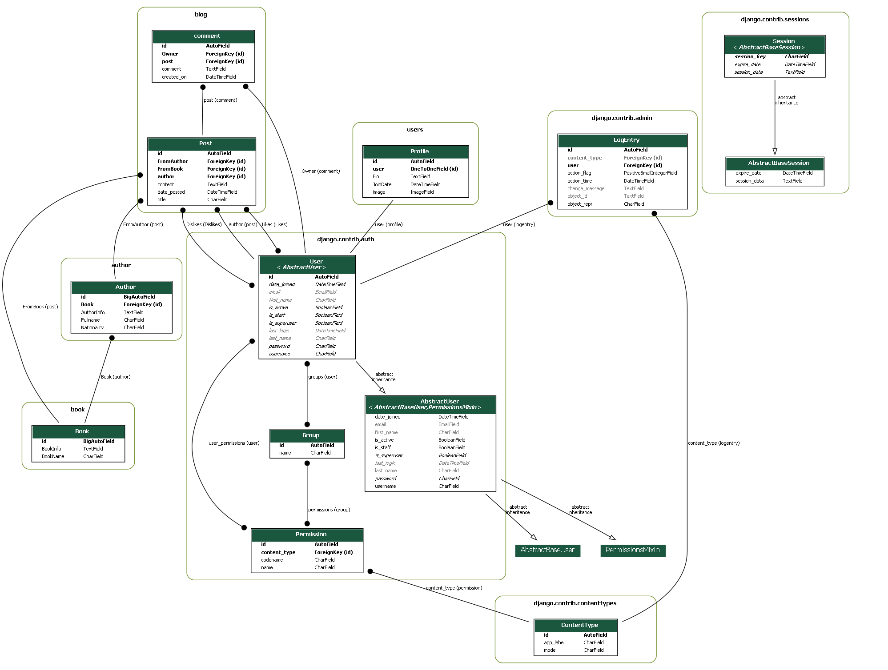

# SocialMedia-Django
Internet Engineering Course Project - 2022

<body>

<h1>Virtual Network (Social Media)</h1>

A platform for sharing quotes and fostering interaction among users.

<h2>Introduction</h2>

Today, with the increase in the world's access to the Internet, the importance of tools to access this technology is increasing exponentially, so that without it, many private businesses or even banks and government organizations are unable to continue their activities. One of these tools is virtual networks, which can be used to communicate with the whole world in the form of text, audio, and video with one click. In this project, it has been tried to provide a platform where different people can share their favorite quotes by joining and other people can also comment and like.

<h2>System Requirements</h2>

Python 3.8 
Django framework 
Pillow 
Django-crispy-forms 
Internet connection

<h2>Requirements</h2>

This project requires the following dependencies:

<pre>
altgraph==0.17.3
asgiref==3.5.2
auto-py-to-exe==2.26.0
bottle==0.12.23
bottle-websocket==0.2.9
cffi==1.15.1
contourpy==1.0.6
cycler==0.11.0
Django==4.1.1
django-crispy-forms==1.14.0
django-extensions==3.2.1
Eel==0.14.0
et-xmlfile==1.1.0
fonttools==4.38.0
future==0.18.2
gevent==22.10.2
gevent-websocket==0.10.1
greenlet==2.0.1
joblib==1.2.0
kiwisolver==1.4.4
matplotlib==3.6.2
numpy==1.23.3
openpyxl==3.0.10
packaging==22.0
pandas==1.5.2
pefile==2022.5.30
Pillow==9.2.0
pycparser==2.21
pydot==1.4.2
pyinstaller==5.7.0
pyinstaller-hooks-contrib==2022.14
pyparsing==3.0.9
python-dateutil==2.8.2
pytz==2022.6
pywin32-ctypes==0.2.0
scikit-learn==1.2.0
scipy==1.9.3
six==1.16.0
sklearn==0.0.post1
sqlparse==0.4.2
threadpoolctl==3.1.0
tzdata==2022.2
whichcraft==0.6.1
zope.event==4.6
zope.interface==5.5.2
</pre>

<h2>Installation</h2>

Python: To install Python, visit www.python.org and download the appropriate version for your operating system and processor architecture.

Django: Install Django by running the following command in your command line: 
<code>pip install Django</code>

Pillow: Install Pillow using the following command: 
<code>pip install pillow</code>

Django-crispy-forms: Install Django-crispy-forms using the following command: 
<code>pip install django-crispy-forms</code>

Note: Internet connection is required due to the use of CDN.

<h2>Database</h2>

By default, Django uses the SQLite database, which is a lightweight but powerful database designed for websites with normal traffic. If you want to use another database, you must enter information such as password, username, created database name, and used database name in the settings.py file and in the DATABASES section.

One of the strong features of Django api is its database, using which you no longer need to write database codes. It is only necessary to create your tables with Python language in the Models.py file and using python manage.py makemigration and migrate python manage.py commands, this api will convert your codes which are in Python language into database language. slow

Our database consists of five main tables: USER, POST, COMMENT, Book, and Author. The rest of the tables are made by the Django framework and related APIs and are often used to implement the authentication system and related to the admin page and the system manager, or related to site access and security. ER diagram is provided for all database tables.

<h2>Project Structure</h2>

The project includes a main project folder called django_project. In addition to the main folder for the project's extensibility, the project is divided into several different sections, each of which is called an app. Each app contains files that exist in each of them and are specific to them. The main project also includes the settings.py file, which includes the project settings. All the apps are connected with the main project by importing the urls.py files related to the apps in the urls.py file of the project, and the name of each app is entered in the settings.py file in the Installed_apps section.

<h2>Usage</h2>

When we run the server using the command <code>python manage.py runserver</code>, the home page is loaded for the user. Then, by joining the website, users can like other posts, comment, or share their own posts. By joining the website, an initial profile will be opened for users, which they can later edit and change their profile picture.

<h2>ER Diagram</h2>

<h2>License</h2>

This project is licensed under the Apache License, Version 2.0. See the <a href="LICENSE">LICENSE</a> file for details.

© 2022 Ali Bayani

</body>
</html>
